# Báo cáo Lab Day 1 — Văn Quốc Dũng — 2A202602505

## 1. Thiết lập

- **Môi trường:** Google Colab, GPU Tesla T4 (compute capability 7.5), PyTorch 2.11.0+cu130. `code/lab.ipynb` được chạy một lượt từ đầu đến cuối (ô 1–22 theo thứ tự, không đọc lại kết quả cũ), seed cố định.
- **Dữ liệu:** Forest CoverType; `train` 464 809 / `eval` 116 203 theo `split_metadata.csv`. Validation: 20% của train (phân tầng, seed 42) → 371 847 train / 92 962 val. 10 cột số được chuẩn hoá bằng mean/std của `X_tr`; 44 cột nhị phân giữ nguyên. Eval không tham gia bước nào trước Part 4.
- **Model:** `M-base` (54→256→128→7, ReLU, 47 879 tham số, logits không qua softmax).
- **Baseline:** cross-entropy, SGD+momentum 0,9, lr 0,1 (chọn bằng val macro-F1 trong {0,01; 0,03; 0,1; 0,3}), batch 512, 20 epoch, khởi tạo He (bias 0), không dropout, không clip, FP32.
- **Mốc tham chiếu:** accuracy "đoán lớp đa số" (lớp 1) trên val = 0,4876.
- **Các chủ đề đã thử:** ☑ loss ☑ optimizer ☑ hyper-parameter ☑ dropout ☑ clipping ☑ mixed precision ☑ init (40 lần chạy, mỗi lần một dòng trong `experiments.xlsx` và một ảnh `figures/<exp_id>.png`).

## 2. Kiểm tra ban đầu và độ nhiễu

| Kiểm tra | Kết quả |
|---|---|
| Số tham số / shape logits | 47 879 / (B, 7) |
| Loss bước 0 (so với ln 7 = 1,946) | 2,2691 (seed 1); 1,9782 (seed 2); 1,9005 (seed 3) |
| Quá khớp 20 mẫu: loss cuối | 1,34e-06 sau 300 bước Adam lr 1e-2, accuracy 100% |
| Mọi tham số có gradient khác 0 | ☑ có (norm W1…b3 từ 0,34 đến 2,02) |
| Baseline, số seed đã chạy | 3 (`base-s1`, `base-s2`, `base-s3`) |
| Baseline: val acc (TB ± σ) | 0,9091 ± 0,0007 |
| Baseline: val macro-F1 (TB ± σ) | 0,8562 ± 0,0019 |

**Ngưỡng nhiễu dùng trong báo cáo:** 2σ = 0,0037 (val macro-F1, σ mẫu của 3 seed). Mọi "Δ" bên dưới là val macro-F1 trừ trung bình baseline 0,8562.

Loss bước 0 lệch khỏi ln 7 vì với He init, logit bước 0 có std ≈ 0,58 chứ không ≈ 0, nên softmax đã nghiêng ngẫu nhiên về vài lớp. Lớp 0 và 1 chiếm 85% dữ liệu, nên tuỳ seed mà loss cao hơn hoặc thấp hơn ln 7. Khi logit ≈ 0 (`normal(0,01)`), loss bước 0 đúng bằng 1,9460.

Đường cong baseline (ảnh dưới): train loss và val loss cùng giảm tới epoch 20 (best epoch 20/20/19), khoảng cách val − train chỉ ≈ 0,02. Model **chưa quá khớp mà còn underfit**; răng cưa nhỏ đến từ lr cố định và nhiễu mini-batch. Hạn chế: σ chỉ ước từ 3 seed, và mỗi thí nghiệm ở mục 3 chỉ chạy 1 seed, nên chênh lệch chỉ hơi vượt 0,0037 là bằng chứng yếu.

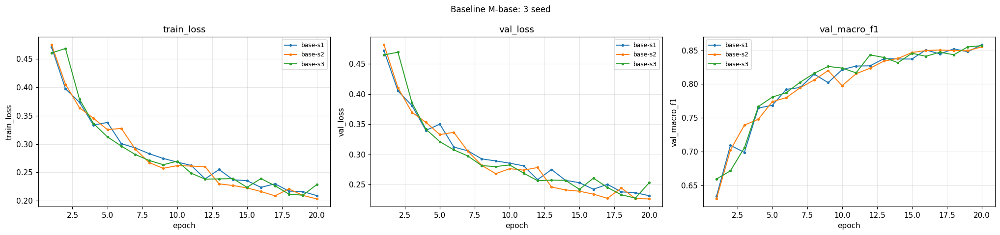

## 3. Kết quả theo chủ đề

### 3.1 Hàm mất mát — CE vs MSE
- **Dự đoán:** MSE trên one-hot sẽ cho macro-F1 thấp hơn rõ rệt, accuracy giảm ít hơn, các lớp nhỏ thiệt nhất.
- **Kết quả:** `loss-mse` val macro-F1 0,7329 (Δ = −0,1233, vượt 2σ), val acc 0,8713 so với 0,9085 của `base-s1`. Đường F1 của MSE vẫn đang đi lên ở epoch 20.

  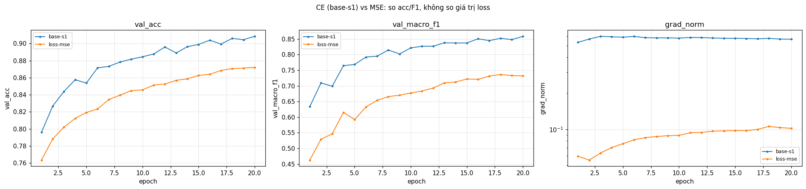
- **Giải thích:** gradient của CE theo logit là (softmax − one-hot), vẫn lớn khi đoán sai một cách tự tin. Với MSE (trung bình trên B×7 phần tử), gradient là 2(z − y)/(B·7). grad_norm đo được chỉ 0,06–0,10 so với 0,53–0,58 của CE, nên ở cùng lr 0,1 bước cập nhật nhỏ hơn 5–9 lần. MSE còn kéo logit của các lớp sai về đúng 0 thay vì chỉ cần thấp hơn lớp đúng. So bằng acc/F1, không so giá trị loss (0,0294 với 0,2314 khác thang đo). Hạn chế: lr 0,1 được chọn cho CE, chưa chỉnh riêng cho MSE.

### 3.2 Bộ tối ưu hoá
- **Dự đoán:** khi mỗi bộ được chỉnh lr riêng, Adam/AdamW ngang hoặc nhỉnh hơn SGD+momentum. SGD không momentum cần lr lớn hơn ~10 lần (1/(1 − μ)) để có cùng bước hiệu dụng, khi đó sẽ gần SGD+momentum. AdamW ≈ Adam vì chưa quá khớp.
- **Mỗi bộ ở lr tốt nhất của nó (theo val):**

  | optimizer | exp_id | lr | val macro-F1 | Δ | best epoch |
  |---|---|---|---|---|---|
  | SGD+momentum 0,9 | `opt-sgdm-lr0.1` | 0,1 | 0,8584 | +0,0021 | 20 |
  | SGD | `opt-sgd-lr1` | 1 | 0,8100 | −0,0462 | 15 |
  | Adam | `opt-adam-lr0.003` | 3e-3 | 0,8683 | +0,0121 | 18 |
  | AdamW (wd 0,01) | `opt-adamw-lr0.003` | 3e-3 | **0,8757** | +0,0195 | 20 |

- **Độ nhạy với lr:** mỗi bộ thử 3–4 lr cách nhau ~3 lần. lr nhỏ hơn lr tốt nhất 10 lần làm mất nhiều nhất vì đi quá chậm trong 20 epoch (SGD+momentum 0,01: 0,7637; Adam 3e-4: 0,7955). Phía lr lớn chỉ giảm ít (SGD+momentum 0,3: 0,8521; Adam 1e-2: 0,8611; AdamW 1e-2: 0,8516). SGD trần dao động mạnh nhất: cả ba lr đều có val loss tăng lại ở các epoch cuối.

  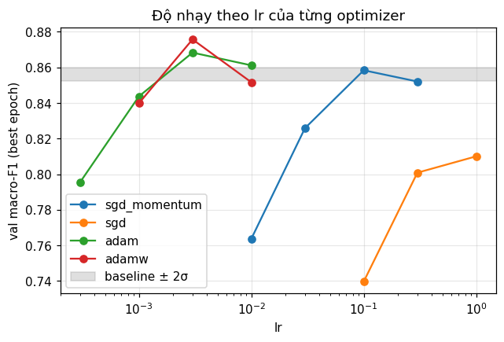
  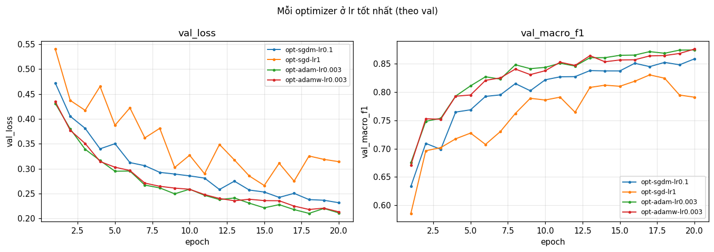
- **Giải thích:** Adam chia bước theo √v của từng tham số, nên trọng số nối với các cột nhị phân hiếm (soil type) vẫn học nhanh. Khác dự đoán: SGD ở lr 1 (cùng bước hiệu dụng với SGD+momentum lr 0,1) vẫn kém 0,048. Momentum không chỉ phóng to bước mà còn lấy trung bình gradient qua ~10 bước, lọc bớt nhiễu mini-batch; SGD trần với lr lớn nhận trọn nhiễu đó. lr 1 nằm ở biên lưới nên lr tốt nhất của SGD có thể chưa được tìm thấy. AdamW hơn Adam 0,0074 (vượt 2σ nhưng chỉ 1 seed), nên chưa đủ để kết luận về weight decay.

### 3.3 Hyper-parameter
Đổi batch size (cùng 20 epoch nên **khác số bước**), độ rộng và độ sâu; mọi thứ khác giữ như baseline.

| exp_id | thay đổi | bước / 20 epoch | s/epoch | val macro-F1 | Δ | vượt 2σ? |
|---|---|---|---|---|---|---|
| `base-s1` | batch 512 | 14 540 | 1,31 | 0,8584 | +0,0021 | Không |
| `hp-batch128` | batch 128 | 58 120 | 5,18 | 0,8563 | 0,0000 | Không |
| `hp-batch2048` | batch 2048 | 3 640 | 0,33 | 0,8090 | −0,0472 | Có |
| `hp-batch2048-lrx4` | batch 2048, lr 0,4, warmup 1 epoch | 3 640 | 0,36 | 0,8536 | −0,0026 | Không |
| `hp-wide` | 54-512-256-7 (161 287 tham số) | 14 540 | 1,33 | 0,8725 | +0,0162 | Có |
| `hp-deep` | 54-256-128-64-7 (55 687 tham số) | 14 540 | 1,47 | 0,8719 | +0,0157 | Có |

- **Batch 2048, cùng lr:** chỉ còn 1/4 số bước nên chưa hội tụ (−0,047). Tăng lr ×4 (kèm warmup để tránh bước quá lớn khi trọng số còn ngẫu nhiên) bù lại được, về trong nhiễu, nhanh ~3,6 lần mỗi epoch.
- **Batch 128 (khác dự đoán):** 4 lần số bước nhưng không tốt hơn, trong khi chậm 4 lần. Giữ lr 0,1 với lô nhỏ hơn 4 lần làm phương sai gradient mỗi bước tăng ~4 lần (∝ 1/B); grad_norm max lên 5,1 ở epoch 5. Bước nhiều hơn nhưng nhiễu hơn.
- **Độ rộng/độ sâu:** cả train loss (0,1758 / 0,1680) lẫn val loss (0,2043 / 0,1964) đều thấp hơn baseline (0,2091 / 0,2314), khoảng cách val − train chỉ tăng nhẹ (0,022 → 0,028). Lợi ích đến từ dung lượng lớn hơn, đúng với việc baseline đang underfit. M-wide làm bộ nhớ tăng thêm gấp đôi (Δmem 34,1 MB so với 16,8 MB) nhưng thời gian/epoch gần như không đổi vì GPU chưa bận.

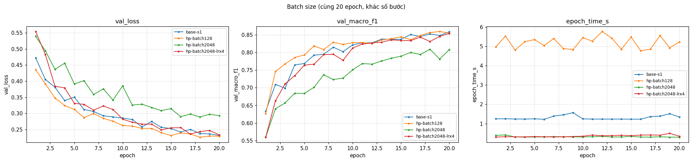
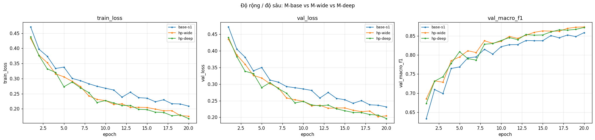

### 3.4 Dropout
- **Dự đoán:** baseline chưa quá khớp, nên dropout chỉ làm mất dung lượng: thu hẹp khoảng cách train–val bằng cách tăng train loss, F1 giảm, càng nhiều khi q càng lớn.

| exp_id | q | train loss cuối | val loss cuối | val − train | val macro-F1 | Δ |
|---|---|---|---|---|---|---|
| `base-s1` | 0 | 0,2091 | 0,2314 | 0,0223 | 0,8584 | +0,0021 |
| `drop-0.1` | 0,1 | 0,2409 | 0,2521 | 0,0113 | 0,8368 | −0,0194 |
| `drop-0.3` | 0,3 | 0,3213 | 0,3259 | 0,0046 | 0,7769 | −0,0794 |
| `drop-0.5` | 0,5 | 0,4042 | 0,4080 | 0,0038 | 0,6630 | −0,1933 |

- **Kết quả:** khoảng cách train–val giảm đúng như dự đoán, nhưng vì train loss tăng; val loss cũng tăng theo. Mọi q đều kém baseline vượt 2σ, kể cả q = 0,1 (tôi đoán q = 0,1 sẽ nằm trong nhiễu). Macro-F1 giảm nhiều hơn accuracy (acc chỉ giảm 0,011–0,081), tức các lớp nhỏ thiệt nhất.
- **Model có thực sự quá khớp không?** Không: ở baseline val loss vẫn giảm tới epoch 20 và khoảng cách chỉ 0,022. Dropout (mỗi bước chỉ (1 − q) nơ-ron hoạt động) là cách giảm dung lượng hiệu dụng, mà model này đang thiếu dung lượng/bước. Ngay cả M-wide 60 epoch ở mục 4 (khoảng cách 0,056) dropout 0,1 vẫn kém 0,005.

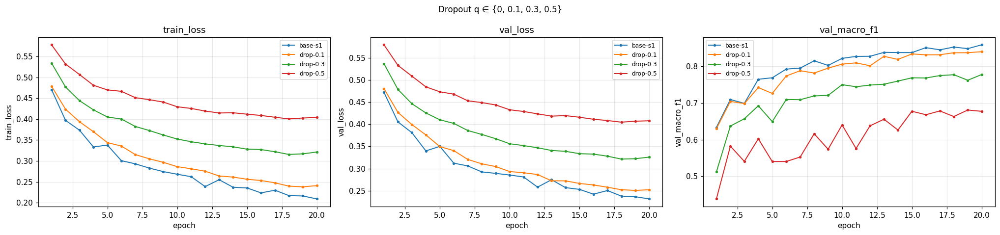

### 3.5 Gradient clipping
- **Chọn c:** từ phân phối grad_norm (đo **trước** clip) của `base-s1`: p50 0,559; p90 0,713; p99 0,938; max 2,871 (ở epoch 1). Chọn c = 0,56 ≈ trung vị để clip thật sự kích hoạt.
- **Ở lr bình thường (0,1):** `clip-0.56` có clip ở 40% số bước của epoch 1 và 56–69% ở các epoch sau, nhưng val macro-F1 0,8548 (Δ = −0,0014, trong nhiễu). Bước cập nhật vốn đã ổn, chặn độ dài gradient chỉ làm một số bước ngắn lại chút ít, đúng dự đoán.
- **Ở lr cao:** tăng lr ×10 lên 1 thì `clip-none-lr1` mất ổn định (không ra NaN): grad_norm vọt lên 11,7 ở epoch 1, val F1 dao động (0,739 ở epoch 11 rơi xuống 0,654 ở epoch 12), tốt nhất chỉ 0,7670. Cùng lr đó có clip, `clip-0.56-lr1` đạt 0,8075 (+0,04 so với không clip, 1 seed) nhưng vẫn kém baseline 0,049. Clipping **không cứu được hết**, khác dự đoán. Theo `results/clip-0.56-lr1.json`, clip chỉ kích hoạt ở 3% số bước của epoch 1 và 0% sau đó, vì ở lr 1 grad_norm điển hình chỉ ≈ 0,25 (p50) < c. Clip chặn được các spike đầu (max đo trước clip 3,4 thay vì 11,7), phần lợi đến từ đó. Dao động về sau là do lr quá lớn so với độ cong của loss chứ không do gradient lớn.

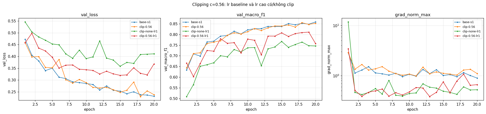

### 3.6 Mixed precision

| exp_id | precision | s/epoch | Δmem (MB) | val macro-F1 | Δ |
|---|---|---|---|---|---|
| `base-s1` | FP32 | 1,31 | 16,80 | 0,8584 | +0,0021 |
| `amp-fp16` | FP16 autocast + GradScaler | 1,80 | 16,80 | 0,8549 | −0,0013 |
| `amp-bf16` | BF16 autocast (giả lập trên T4) | 1,53 | 16,80 | 0,8547 | −0,0015 |

- **Độ chính xác** không đổi (trong nhiễu): tham số và bước cập nhật vẫn ở FP32. GradScaler bỏ qua 4 bước (epoch 9, 12, 16, 19) vì gradient FP16 bị inf. Khoảng cách ~3 epoch ≈ 2 000 bước khớp với chu kỳ thử tăng scale mặc định (`growth_interval` = 2 000).
- **Không nhanh hơn, mà chậm hơn** (FP16 +38%, BF16 +17%). M-base chỉ 47 879 tham số với lô 512, mỗi phép nhân ma trận quá nhỏ để Tensor Core tạo khác biệt; thời gian bị chi phối bởi chi phí khởi chạy kernel, mà autocast còn thêm kernel ép kiểu và GradScaler thêm unscale + kiểm tra inf mỗi bước. T4 (sm75) không có phần cứng BF16 nên BF16 chạy giả lập. Việc BF16 nhanh hơn FP16 có lẽ vì không cần GradScaler (phỏng đoán, chưa đo riêng).
- **Bộ nhớ** không đổi: activation khi train lô 512 qua M-base chỉ cỡ 1–2 MB. Đỉnh bộ nhớ nhiều khả năng nằm ở bước evaluate (lô 8 192, chạy FP32 ngoài autocast); Δmem của M-wide tăng gấp đôi cũng khớp với điều này.

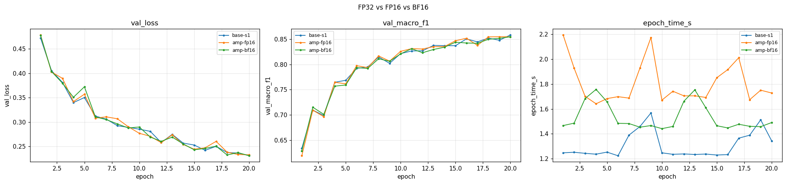

### 3.7 Khởi tạo tham số

| init | std z1 | std z2 | std logits | loss bước 0 | exp_id (20 epoch) | val macro-F1 | Δ |
|---|---|---|---|---|---|---|---|
| he (baseline) | 0,661 | 0,640 | 0,577 | 2,2691 | `base-s1` | 0,8584 | +0,0021 |
| xavier (`xavier_normal_`) | 0,276 | 0,218 | 0,192 | 2,0222 | `init-xavier` | 0,8585 | +0,0023 |
| normal(0; 0,01) | 0,034 | 0,0038 | 0,0003 | 1,9460 | `init-normal` | 0,8485 | −0,0077 |
| zeros | 0 | 0 | 0 | 1,9459 | `init-zeros` | 0,0936 | −0,7626 |
| default (`nn.Linear`) | 0,274 | 0,113 | 0,059 | 1,9830 | (chỉ đo bước 0) | | |

(std kích hoạt sau mỗi Linear trên một lô val 4 096 mẫu.)

- **zeros:** mọi kích hoạt ẩn = ReLU(0) = 0 và W3 = 0, nên sau một backward chỉ b3 có gradient (norm 0,497), mọi tham số khác bằng 0 tuyệt đối. Các nơ-ron cùng lớp nhận cùng một gradient nên đối xứng không bao giờ bị phá. Mạng chỉ học được tần suất lớp: acc 0,4876, F1 0,0936 suốt 20 epoch (đúng mốc đoán đa số), val loss 1,2052 = entropy của phân phối lớp.
- **normal(0,01):** std co lại ~10 lần mỗi lớp (0,01·√(n_vào/2) ≈ 0,1), logit ≈ 0 nên loss bước 0 = ln 7. Gradient nhỏ làm khởi đầu chậm (F1 epoch 1: 0,48 so với 0,63 của He), sau đó đuổi kịp phần lớn vì mạng chỉ có 3 lớp (−0,0077, vượt 2σ nhưng 1 seed).
- **xavier:** không bù hệ số 1/2 của ReLU nên std giảm ~0,8 lần mỗi lớp, còn He giữ gần như nguyên. Với 3 lớp, kết quả không phân biệt được với He. Mạng 3 lớp không đủ sâu để thấy hiện tượng "30 lớp ReLU" của slide; ở 30 lớp, 0,8³⁰ ≈ 0,001.

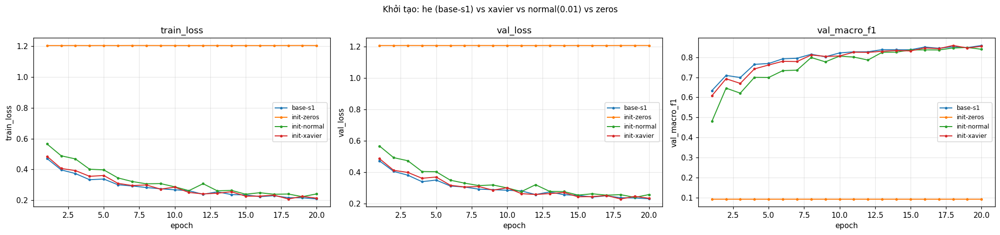

## 4. Đánh giá cuối trên tập eval

| Cấu hình | Seed nộp | val macro-F1 | **eval macro-F1** | eval accuracy |
|---|---|---|---|---|
| Baseline (`base-s1`) | 1 | 0,8584 | **0,8618** | 0,9064 |
| Cấu hình cuối cùng (`final-wide-d0-s1`) | 1 | 0,9300 | **0,9342** | 0,9571 |

- **Cấu hình cuối và cách chọn (chỉ bằng val):** lấy optimizer + lr tốt nhất theo val trong mọi lần chạy chủ đề optimizer (AdamW lr 3e-3, wd 0,01), huấn luyện 60 epoch với lr giảm theo cosine, thử M-base/M-wide × dropout {0; 0,1}. Lý do: baseline và M-wide/M-deep đều còn underfit ở epoch 20. Kết quả theo val (seed 1): `final-base-d0-s1` 0,9116; `final-base-d0.1-s1` 0,8973; `final-wide-d0-s1` **0,9300**; `final-wide-d0.1-s1` 0,9249. Chọn `final-wide-d0-s1`, rồi chạy thêm seed 2, 3: val macro-F1 0,9292 ± 0,0011.
- **Phần lợi đến từ đâu (val, 1 seed):** cùng M-base và AdamW 3e-3, 60 epoch + cosine hơn 20 epoch 0,036 (`final-base-d0-s1` so với `opt-adamw-lr0.003`). Mạng rộng thêm +0,018. Dropout 0,1 vẫn hại. Cấu hình cuối đổi nhiều yếu tố cùng lúc nên +0,073 là hiệu ứng tổng.
- **Cải thiện trên eval:** +0,0723 macro-F1 (0,9342 so với 0,8618), +0,051 accuracy. Eval chỉ chạy một lần cho mỗi cấu hình (seed 1) nên không có σ trên eval. Trên val, chênh lệch +0,073 lớn gấp ~20 lần 2σ của baseline (0,0037) và của cấu hình cuối (0,0022), nên cải thiện này vượt xa nhiễu seed.
- **Val và eval gần nhau:** cả hai cấu hình đều có eval cao hơn val chỉ ~0,004 (0,8584 → 0,8618; 0,9300 → 0,9342). Phân phối lớp của val và eval gần như trùng nhau, và eval không được dùng để chọn gì, nên không có dấu hiệu khớp riêng vào val.

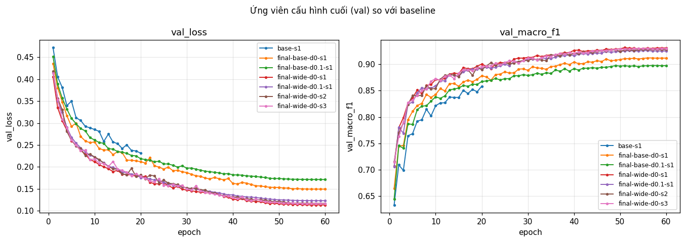

### 4.1 Phân tích lỗi theo lớp

Số liệu của `final-wide-d0-s1` trên eval (`eval_result.json`); cột cuối là F1 của baseline (`eval_baseline/eval_result.json`). Tên lớp theo mô tả bộ dữ liệu UCI Covertype (nhãn đã trừ 1).

| Lớp | support | precision | recall | F1 | F1 baseline |
|---|---|---|---|---|---|
| 0 Spruce/Fir | 42 368 | 0,9575 | 0,9514 | 0,9544 | 0,9012 |
| 1 Lodgepole Pine | 56 661 | 0,9608 | 0,9660 | 0,9634 | 0,9211 |
| 2 Ponderosa Pine | 7 151 | 0,9586 | 0,9575 | 0,9580 | 0,8999 |
| 3 Cottonwood/Willow | 549 | 0,8909 | 0,8780 | **0,8844** | 0,8194 |
| 4 Aspen | 1 899 | 0,8981 | 0,8868 | 0,8924 | 0,7692 |
| 5 Douglas-fir | 3 473 | 0,9278 | 0,9220 | 0,9249 | 0,8018 |
| 6 Krummholz | 4 102 | 0,9586 | 0,9644 | 0,9615 | 0,9200 |

Ma trận nhầm lẫn (hàng = nhãn thật, cột = dự đoán):

| | 0 | 1 | 2 | 3 | 4 | 5 | 6 |
|---|---|---|---|---|---|---|---|
| **0** | 40 310 | 1 883 | 1 | 0 | 18 | 3 | 153 |
| **1** | 1 629 | 54 734 | 72 | 0 | 147 | 61 | 18 |
| **2** | 2 | 87 | 6 847 | 40 | 21 | 154 | 0 |
| **3** | 0 | 0 | 46 | 482 | 0 | 21 | 0 |
| **4** | 30 | 166 | 9 | 0 | 1 684 | 10 | 0 |
| **5** | 6 | 74 | 168 | 19 | 4 | 3 202 | 0 |
| **6** | 124 | 21 | 0 | 0 | 1 | 0 | 3 956 |

- **Lớp khó nhất là lớp 3 (Cottonwood/Willow), F1 = 0,8844.** Nó hay bị nhầm với lớp 2 (46/549 = 8,4%) và lớp 5 (21/549 = 3,8%). Ngược lại, 40 mẫu lớp 2 và 19 mẫu lớp 5 bị đoán thành lớp 3, nên precision cũng chỉ 0,891.
- **Lý giải bằng dữ liệu** (thống kê trên `data/processed/train.npz`, 464 809 mẫu): lớp 3 chỉ có 2 198 mẫu train (0,47%), ít hơn lớp 2 (28 603) 13 lần và lớp 5 (13 894) 6 lần. Ba lớp cùng ở độ cao thấp (Elevation trung bình 2 224 ± 102 m, 2 394 ± 196 m, 2 419 ± 189 m) và cùng vùng hoang dã 4 (100% mẫu lớp 3, 60% lớp 2, 56% lớp 5). Hai đặc trưng tách loài cây mạnh nhất vì vậy chồng lấn. Với CE không trọng số, lớp 3 đóng góp rất ít vào loss nên ranh giới bị kéo về phía hai lớp lớn hơn. Lớp 4 (Aspen, 1 899 mẫu) là trường hợp tương tự với lớp 1 (166 mẫu, 8,7%).
- Về số lượng, 70% trong 4 988 lỗi là nhầm giữa lớp 0 và 1 (1 883 + 1 629): hai lớp lớn có độ cao chồng lấn (3 129 ± 158 m và 2 921 ± 186 m). Nhưng vì support lớn nên F1 của hai lớp này vẫn cao.
- Cấu hình cuối tăng F1 ở mọi lớp, nhiều nhất ở các lớp nhỏ (lớp 4 +0,123, lớp 5 +0,123, lớp 3 +0,065).
- **Cách cải thiện sẽ thử:** CE có trọng số theo lớp (hoặc lấy mẫu lại) cho các lớp 3, 4, 5, chọn trọng số bằng val macro-F1.

## 5. Trả lời các câu hỏi dẫn dắt

1. **Bộ tối ưu nào "thắng" khi mỗi cái được chỉnh lr công bằng?** AdamW lr 3e-3 (0,8757) > Adam 3e-3 (0,8683) > SGD+momentum 0,1 (0,8584) > SGD 1 (0,8100). Adam/AdamW hơn SGD+momentum vượt 2σ, còn AdamW so với Adam chỉ là 1 seed. **Khi không chỉnh lr thì kết luận đổi:** ở lr 1e-3 (mặc định thường dùng cho Adam), AdamW chỉ 0,8398 và Adam 0,8437, thua SGD+momentum ở lr 0,1. Ở lr 0,1 dùng chung, SGD trần chỉ 0,7397, kém SGD+momentum 0,12, nhưng khi được lr 1 thì khoảng cách còn 0,048. Phần lớn "khác biệt giữa optimizer" khi không chỉnh lr thực ra là khác biệt do lr.
2. **Dropout có giúp không khi mô hình chưa quá khớp?** Không. Baseline có khoảng cách val − train chỉ 0,022 và val loss còn giảm; mọi q đều làm val macro-F1 giảm vượt 2σ (−0,019 / −0,079 / −0,193). Kể cả M-wide 60 epoch (khoảng cách 0,056, val loss vẫn giảm tới epoch 57), dropout 0,1 vẫn kém 0,005. Nên dùng khi val loss tăng lại trong lúc train loss vẫn giảm (model lớn so với dữ liệu, huấn luyện lâu), và chọn q theo mức quá khớp đo được.
3. **Gradient clipping giải quyết vấn đề gì?** Nó chặn các bước cập nhật bùng nổ khi grad_norm có spike. Bằng chứng: ở lr 1 không clip, grad_norm đạt 11,7 ở epoch 1 và F1 tốt nhất chỉ 0,7670; có clip c = 0,56 thì max chỉ 3,4 và F1 0,8075. Nó **không** sửa được lr quá lớn: sau epoch 1, grad_norm điển hình ≈ 0,25 < c nên clip không kích hoạt (0% số bước), và dao động vẫn còn. Ở lr 0,1 không có spike nên clip (dù kích hoạt 56–69% số bước) không đổi kết quả.
4. **Mixed precision có làm huấn luyện nhanh hơn không?** Không: FP16 1,80 s/epoch và BF16 1,53 s/epoch, so với 1,31 s của FP32. Độ chính xác và bộ nhớ không đổi. Mạng 47 879 tham số với lô 512 quá nhỏ để Tensor Core có lợi, thời gian bị chi phối bởi chi phí khởi chạy kernel, mà AMP còn thêm kernel ép kiểu và GradScaler. T4 không có phần cứng BF16.
5. **Vì sao khởi tạo toàn số 0 hỏng?** Với ReLU(0) = 0 và W3 = 0, mọi gradient trừ b3 bằng 0 (đã đo); các nơ-ron cùng lớp đối xứng tuyệt đối và không bao giờ khác nhau, nên mạng chỉ học tần suất lớp (F1 0,0936, loss dừng ở entropy 1,205). **He so với Xavier:** He dùng Var = 2/n_vào để bù việc ReLU bỏ một nửa phương sai, nên std kích hoạt giữ ổn định (0,66 → 0,64 → 0,58). Xavier dùng 2/(n_vào + n_ra), không tính đến ReLU, nên std giảm ~0,8 lần mỗi lớp (0,28 → 0,22 → 0,19). Điều này quan trọng với mạng sâu (0,8³⁰ ≈ 0,001 ở 30 lớp), còn với 3 lớp thì kết quả như nhau (0,8585 so với 0,8584).
6. **Loss không giảm sau 2 000 bước: 3 phép kiểm tra đầu tiên.**
   1. **Kiểm tra pipeline bằng loss bước 0 và quá khớp một lô nhỏ.** Loss bước 0 phải ≈ ln(số lớp) (ở đây 2,27 so với 1,95), và model phải đưa được loss về ≈ 0 trên 20 mẫu (ở đây 1,34e-06). Nếu không quá khớp được 20 mẫu, lỗi nằm ở dữ liệu/nhãn (ví dụ nhãn 1..7 chưa trừ 1), hàm loss, hoặc vòng lặp (thiếu `zero_grad`/`step`), không phải ở siêu tham số. Đây là phép thử rẻ nhất và loại trừ được nhiều nguyên nhân nhất.
   2. **Đo grad_norm của từng tham số (trước clip).** Gradient bằng 0 ở hầu hết tham số cho thấy mạng "chết" hoặc đối xứng: `init-zeros` có đúng triệu chứng này, loss đứng yên ở 1,205 vì chỉ b3 có gradient. grad_norm rất nhỏ ở lớp đầu là vanishing (`init-normal` khởi đầu chậm). Spike hoặc NaN cho thấy lr quá lớn (`clip-none-lr1`: 11,7).
   3. **Quét lr theo bước ~3 lần.** lr quá nhỏ làm loss giảm rất chậm, trông như "không giảm" (`opt-sgdm-lr0.01`: F1 0,7637 so với 0,8584 ở lr 0,1). lr quá lớn làm loss dao động thay vì giảm (`opt-sgd-lr1`, `clip-none-lr1`). Kèm theo đó kiểm tra input đã được chuẩn hoá bằng thống kê train.

## 6. Hạn chế và điều bất ngờ

- **Kết quả khác dự đoán:**
  - batch 128 không tốt hơn dù gấp 4 lần số bước: nhiễu gradient tăng ở cùng lr.
  - SGD trần ở lr 1 vẫn thua SGD+momentum lr 0,1: momentum còn lọc nhiễu, không chỉ phóng to bước.
  - Clipping không cứu được lr 1: vấn đề sau epoch 1 là lr chứ không phải spike gradient.
  - AdamW hơn Adam 0,0074 dù chưa quá khớp: 1 seed, chưa kết luận.
  - dropout 0,1 vẫn hại cả với M-wide 60 epoch.
  - Cấu hình cuối vượt mức tôi dự đoán (0,93 so với 0,90–0,92).
- **Điều có thể làm kết luận sai:**
  - Mỗi thí nghiệm ở mục 3 chỉ 1 seed, và 2σ ước từ 3 seed của một cấu hình (SGD+momentum) rồi áp cho mọi cấu hình khác. Các chênh lệch sát ngưỡng (`init-normal` −0,0077, AdamW so với Adam, dropout trên M-wide) cần thêm seed.
  - lr chỉ được chỉnh cho baseline. MSE, dropout, init, AMP đều dùng lr 0,1, có thể không phải lr tốt nhất cho chúng.
  - Cùng 20 epoch nhưng khác số bước khi đổi batch. lr tốt nhất của SGD nằm ở biên lưới.
  - Cấu hình cuối đổi nhiều yếu tố cùng lúc. Phần tách riêng hiệu ứng ở mục 4 chỉ dựa trên 1 seed mỗi ứng viên.
  - Eval chỉ có 1 seed mỗi cấu hình nên không có σ trên eval.
  - Thời gian AMP đo trên một model rất nhỏ và một GPU (T4, BF16 giả lập), không tổng quát cho mạng lớn.
- **Nếu có thêm thời gian:**
  - CE có trọng số theo lớp cho các lớp 3, 4, 5.
  - Thêm seed cho các so sánh sát ngưỡng.
  - Mở rộng lưới lr của SGD (> 1) và chỉnh lr riêng cho MSE.
  - Mạng rộng hơn hoặc huấn luyện lâu hơn nữa (val vẫn tăng tới epoch 57–60), rồi thử lại dropout khi thực sự thấy quá khớp.

## 7. Phụ lục

- **File đã nộp:**
  - `REPORT.md`, `experiments.xlsx` (40 dòng, 4 sheet), `predictions_eval.csv`, `eval_result.json`
  - `figures/`: 40 ảnh `<exp_id>.png` và 11 ảnh `compare_*.png`
  - `results/`: 40 file `<exp_id>.json`
  - `eval_baseline/`: dự đoán và kết quả eval của baseline, để đối chiếu cột `eval_*` của `base-s1`
  - `code/`: `lab.ipynb`, `data.py`, `model.py`, `optimizer.py`, `train.py`, `plots.py`, `results_table.py`
- **Thời gian chạy:** tổng thời gian huấn luyện của 40 lần chạy ≈ 26 phút trên T4 (tổng `time_per_epoch_s` × số epoch); cả notebook mất thêm vài phút cho dữ liệu, đánh giá và vẽ ảnh.
